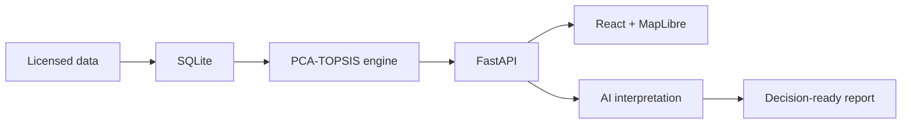

# UrbanInsight AI

English | [简体中文](./README.zh-CN.md)

## AI-Powered Urban Decision Intelligence Platform

An AI-assisted platform that turns complex borough-level data into interpretable comparisons, insights, and decision-ready reports.

> **Portfolio status:** source code and the analysis workflow are public; the application has not been publicly deployed. Third-party source data is excluded pending redistribution-rights review.

## Overview

UrbanInsight AI is a map-first decision intelligence platform for exploring and comparing London boroughs. It brings spatial exploration, reproducible statistical evidence, AI interpretation, contextual comparison, and report generation into one continuous workflow.

Users can:

- explore London boroughs through an interactive map;
- review indicators, composite scores, ranks, and contribution evidence;
- request AI explanations of stored statistical results;
- ask follow-up questions and compare boroughs;
- export decision-ready PDF or editable Markdown reports.

It is designed as an **AI urban analysis assistant**, not a conventional dashboard that stops at visualizing metrics.

## The Problem

Regional analysis is often fragmented across datasets, statistical tools, maps, interpretation, and report writing. Composite scores can show *what* happened without making *why* it happened accessible to non-specialist users. Comparisons are frequently manual, and dense dashboards can make evidence harder rather than easier to understand.

> **How might we turn complex urban indicators into an understandable and decision-ready exploration experience?**

## Product Insight

### Map first

The map provides spatial context and acts as the primary entry point for borough discovery and selection.

### Statistics as evidence

A deterministic PCA-weighted TOPSIS engine produces reproducible scores, ranks, dimension results, and contribution evidence.

### AI as interpretation

AI explains, summarizes, and compares stored evidence. It does not recalculate PCA or TOPSIS, invent ranks, or replace the statistical layer.

### Reports as decision output

The workflow moves beyond dashboard exploration and packages completed analysis into exportable PDF and Markdown reports.

## Product Experience

```text
Explore the map
↓
Select a borough
↓
Review scores and evidence
↓
Enable AI interpretation
↓
Ask follow-up questions
↓
Compare boroughs
↓
Export a report
```

## Core Features

- Map-first London borough exploration
- Borough search, hover preview, selection, and camera reset
- PCA-weighted TOPSIS scoring and ranking
- Dimension, indicator, and contribution interpretation
- Qwen and DeepSeek live AI insights, with a token-free Mock mode
- Contextual follow-up chat
- Borough-to-borough comparison
- Charted A4 PDF and editable Markdown report generation
- English and Simplified Chinese product experience
- Basic-analysis fallback when live AI is disabled or unavailable

## AI Design

The AI layer is deliberately separated from the mathematical analysis engine.

| AI is responsible for | AI is not responsible for |
| --- | --- |
| Explaining supplied evidence | Recalculating PCA |
| Summarizing strengths and weaknesses | Recalculating TOPSIS |
| Comparing borough contexts | Inventing scores or ranks |
| Producing interpretive recommendations | Replacing source evidence or domain review |

Structured responses are schema-validated, prompts separate evidence from interpretation, borough context is rebuilt server-side, and provider errors are sanitized before reaching the frontend.

> **Evidence first, interpretation second.**

## System Overview



The frontend and AI layer do not read the source CSV directly. Statistical results are calculated separately, persisted, and supplied to the AI as authoritative context. See the [Technical Guide](./docs/TECHNICAL_GUIDE.md) for architecture, setup, API, validation, and data-policy details.

## Product Screenshots

Verified public screenshots have not been added yet. Planned coverage includes:

- map exploration;
- borough analysis;
- AI insights;
- comparison;
- report export.

Future captures will be stored in [`docs/screenshots/`](./docs/screenshots/). No mock or fabricated product screenshots are used.

## Live Demo

**Deployment in progress.**

The repository currently supports local execution after appropriately licensed data is prepared. It is not a clone-and-run hosted demo because third-party source data and credentials are intentionally excluded.

## Role and Contribution

**Independent Product Designer and Developer — 2026 productization phase**

- Product strategy and portfolio positioning
- UX and interaction design
- AI workflow, provider strategy, and safety boundaries
- Data-analysis architecture and PCA-weighted TOPSIS implementation
- Frontend and backend implementation
- Comparison and report workflows
- English and Simplified Chinese experience

The analytical foundation began as a **three-person academic research project from November 2024 to January 2025**, where I served as project lead. That research used PCA for composite evaluation and Moran's I, LISA, and Getis-Ord Gi* for spatial analysis. The web platform, PCA-weighted TOPSIS engine, AI decision agent, and product implementation were independently designed and built in June 2026. TOPSIS was not part of the original group methodology.

## Technology

`React` · `TypeScript` · `MapLibre GL JS` · `FastAPI` · `SQLite` · `PCA` · `TOPSIS` · `Qwen` · `DeepSeek` · `ReportLab`

## Documentation

- [Technical Guide](./docs/TECHNICAL_GUIDE.md) — architecture, setup, data preparation, environment variables, API, tests, and limitations
- [Public Project Archive](./docs/UrbanInsight_AI_Project_Archive.md) — project context, decisions, scope, contribution, and evolution
- [Product and engineering specifications](./specs/)
- [Simplified Chinese README](./README.zh-CN.md)

## Disclaimer

UrbanInsight AI is an independent portfolio-stage product and has not been publicly deployed or production-hardened. AI output is interpretive decision support and must be reviewed before use in real planning decisions. Live behavior depends on external model availability, access, quota, and user-supplied credentials.

Compiled CSV and GeoJSON artifacts are not distributed because their field-level provenance and redistribution rights have not yet been fully verified. Users must prepare appropriately licensed data as described in the [Technical Guide](./docs/TECHNICAL_GUIDE.md). No project software licence has been selected; the bundled font retains its own SIL Open Font License.
