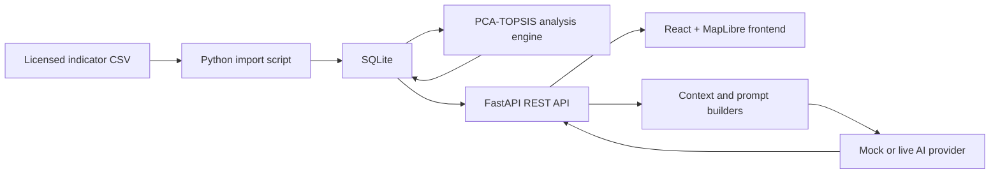

# UrbanInsight AI

English | [简体中文](./README.zh-CN.md)

UrbanInsight AI is a map-first urban decision intelligence platform for exploring and comparing London boroughs. It combines a reproducible statistical analysis pipeline with an AI interpretation layer so that users can move from regional indicators to ranked evidence, explanations, comparisons, and decision-ready reports.

The project is a local, portfolio-stage application. It has not been publicly deployed, and the repository does not include third-party source datasets or API credentials.

## Project Timeline and Role

- **November 2024 to January 2025:** a three-person academic research project on London's urban quality of life. I served as project lead. The research used PCA for composite evaluation and Moran's I, LISA, and Getis-Ord Gi* analysis for spatial patterns.
- **June 2026:** I independently designed and implemented the product platform, backend data pipeline, PCA-weighted TOPSIS analysis engine, interactive frontend, and provider-agnostic AI decision agent.

PCA-weighted TOPSIS belongs to the 2026 platform phase. It was not part of the original group research methodology.

## What the Product Does

1. Search for, hover over, or select a London borough on an interactive map.
2. Retrieve borough indicators and stored analysis results from FastAPI.
3. Present the overall score, London-wide rank, dimension scores, indicator profile, PCA contributions, and TOPSIS result.
4. Optionally enable AI Insights for the next analysis and ask the configured provider to interpret the supplied statistical result without recalculating it.
5. Continue with contextual questions or borough comparisons, then export a
   decision-ready PDF or editable Markdown report.

## Core Features

- MapLibre GL JS borough exploration with hover, selection, search, and camera reset
- English and Simplified Chinese interface
- Persisted, per-analysis AI Insights preference with basic-analysis fallback
- SQLite-backed borough, indicator, and analysis-result storage
- Explicit CSV import and database initialization scripts
- PCA-based objective weighting and TOPSIS ranking
- Structured `AnalysisInsights` generation
- Contextual follow-up chat and borough comparison
- Charted A4 PDF report generation with Markdown as a secondary export
- OpenAI, Qwen, and DeepSeek provider strategies
- Token-free mock AI mode for UI development
- Responsive map, AI panel, and analysis workspace

## Architecture



The frontend never reads SQLite or the indicator CSV directly. The AI layer receives structured, stored results from the backend and is not allowed to calculate PCA, TOPSIS, or rankings.

## Technology Stack

| Layer | Technology |
| --- | --- |
| Frontend | React, TypeScript, Vite, Tailwind CSS, shadcn/ui |
| Mapping | MapLibre GL JS |
| Charts | Recharts |
| Localization | i18next, react-i18next |
| Backend | Python, FastAPI, Pydantic |
| Database | SQLite |
| Analysis | NumPy, pandas, scikit-learn |
| AI | OpenAI Python SDK with OpenAI, Qwen, DeepSeek, and mock strategies |
| Tests | Python `unittest`, FastAPI TestClient, mocked provider calls |

## Data and Analysis

The importer validates this exact 15-column header. It expects one row per borough,
with 12 benefit-oriented numeric indicator fields:

```text
Region,LAD code,Region name,GDHI per head of population (pounds),
Business Density per 1,000 Population (firms),
Average House Price/Earnings ratio_reverse,police_mean,
Convenient_service_mean,cultural_mean,meandical_mean,bus_new_mean,
ndvi_mean,wet_mean,landscape_index,Household Waste Recycling Rates (%)
```

The 2026 analysis engine standardizes the indicators, applies PCA to derive objective indicator weights, and uses those weights in TOPSIS to calculate closeness scores and ranks. The source CSV already provides reversed versions of cost-oriented indicators; the engine does not independently reverse those fields.

The original 2024-2025 research used POI, land use, Landsat, official statistics, and administrative-boundary inputs. Its spatial analysis included Global Moran's I, LISA, and Getis-Ord Gi*. Those spatial statistics informed the research project but are not recalculated by the current web platform.

### Data Licensing and Repository Policy

The research report references OpenStreetMap/Overpass Turbo, Impact Observatory/Esri Living Atlas land cover, USGS Landsat, London Datastore/ONS statistics, and UK Data Service boundary data. These upstream sources use different licences and attribution requirements.

The compiled local CSV and GeoJSON files do not contain sufficient field-level provenance or licence metadata to prove that the compiled artifacts may be redistributed. They are therefore intentionally excluded from this public repository pending a separate rights review. They are not covered by any licence that may later be applied to the project software.

To run the project, prepare appropriately licensed data at:

```text
data/london_indicators.csv
data/london_boroughs.geojson
public/data/london_boroughs.geojson
```

The two GeoJSON paths currently contain the same `FeatureCollection`: `data/` is the canonical working copy and `public/data/` is the browser-served copy. Each feature must use `Polygon` or `MultiPolygon` geometry and include a `properties.name` value matching `Region name`. Missing browser GeoJSON is handled without crashing, but map polygons will not be available.

Relevant upstream terms should be checked before preparing data:

- [OpenStreetMap copyright and ODbL attribution](https://www.openstreetmap.org/copyright/en)
- [Impact Observatory Maps for Good, CC BY 4.0](https://docs.impactobservatory.com/lulc-maps/maps-for-good.html)
- [USGS Landsat public-domain guidance](https://www.usgs.gov/faqs/are-landsat-data-cloud-still-considered-be-within-public-domain)
- [ONS geography licences](https://www.ons.gov.uk/methodology/geography/licences)
- [UK Data Service 2011 Census geography boundaries](https://statistics.ukdataservice.ac.uk/dataset/2011-census-geography-boundaries-uk)

## AI Decision Agent

The provider layer implements a common strategy interface for structured insights and plain-text responses. The web AI switch selects basic preset analysis or a request-level live analysis; the adjacent selector chooses DeepSeek or Qwen. `AI_PROVIDER` supplies the live default when a request omits the provider. `AI_MODE` remains available for legacy calls, CLI development, and automated test fixtures, but it does not override an explicit web AI request.

For structured analysis, the provider is instructed to return JSON, the response is parsed defensively, and Pydantic validates it as `AnalysisInsights`. Chat, comparison, and report endpoints return plain text through unchanged API schemas.

PDF export is a separate deterministic ReportLab pipeline. It combines the completed
analysis metadata and structured insights already held by the frontend with
authoritative indicators and persisted PCA/TOPSIS results reloaded by the backend.
It does not make another LLM call. English reports use the standard PDF font stack;
Simplified Chinese reports embed Noto Sans CJK SC, distributed under the font's
included SIL Open Font License.

The principal hallucination controls are:

- statistical results are loaded from SQLite, not invented by the model;
- the prompt clearly separates evidence from interpretation;
- the model is prohibited from recalculating scores or rankings;
- structured output is schema-validated;
- borough context is rebuilt server-side for each request;
- provider errors are sanitized before reaching the frontend.

These controls reduce risk but do not guarantee factual correctness. AI recommendations remain interpretive output and should be reviewed before use in real planning decisions.

## Project Structure

```text
backend/
  analysis/             PCA-TOPSIS analysis engine
  app/
    ai/                 agent, prompts, context, schemas, provider strategies
    database.py         SQLite connection and path resolution
    main.py             FastAPI application and routes
    repository.py       database queries
  scripts/              CSV import and analysis runners
  tests/                backend and provider tests
data/                   local source data (not distributed)
public/data/            browser-served GeoJSON (not distributed)
specs/                  product, UI, data, backend, AI, and configuration specs
src/
  app/                  application orchestration and state
  components/           map, search, AI panel, analysis workspace, UI primitives
  i18n/                 English and Simplified Chinese resources
  lib/                  API client and utilities
  styles/               design tokens and global styles
  types/                shared frontend types
```

## Local Setup

### Prerequisites

- Node.js 20 or later
- pnpm
- Python 3.11 or later

### Frontend

```bash
pnpm install
pnpm run dev
```

The Vite development server normally runs at `http://127.0.0.1:5173`.

### Backend

```bash
cd backend
python3 -m venv .venv
source .venv/bin/activate
pip install -r requirements.txt
cp .env.example .env
```

From the project root, initialize and import the database:

```bash
backend/.venv/bin/python -m backend.scripts.import_data \
  --csv data/london_indicators.csv
backend/.venv/bin/python -m backend.scripts.run_analysis
```

Start FastAPI from either location:

```bash
# Project root
backend/.venv/bin/python -m uvicorn app.main:app --app-dir backend --reload

# Or backend/
.venv/bin/python -m uvicorn app.main:app --reload
```

Both commands resolve the default database to `backend/urban_insight.db`.

## Environment Configuration

Use `backend/.env.example` as the template. Never expose keys through Vite variables or commit a populated `.env`.

```dotenv
AI_MODE=mock
AI_PROVIDER=deepseek

OPENAI_API_KEY=
OPENAI_MODEL=gpt-4o-mini

DASHSCOPE_API_KEY=
QWEN_MODEL=
QWEN_BASE_URL=https://dashscope.aliyuncs.com/compatible-mode/v1

DEEPSEEK_API_KEY=
DEEPSEEK_MODEL=
DEEPSEEK_BASE_URL=https://api.deepseek.com

URBANINSIGHT_DB_PATH=
```

Recommended workflow:

```text
UI development -> AI_MODE=mock -> no external LLM cost
AI integration testing -> AI_MODE=live -> configured provider
```

## Validation

```bash
# Frontend TypeScript compilation and production build
pnpm run build

# Backend compilation
backend/.venv/bin/python -m compileall backend

# Backend tests
PYTHONPATH=backend backend/.venv/bin/python -m unittest discover \
  -s backend/tests -v
```

External LLM calls are mocked in automated tests.

## API Summary

Core data endpoints:

- `GET /boroughs`
- `GET /boroughs/{id}`
- `GET /indicators/{borough_id}`
- `GET /analysis/{borough_id}`

AI endpoints:

- `GET /ai/status`
- `POST /ai/analyze`
- `POST /ai/chat`
- `POST /ai/compare`
- `POST /ai/report`
- `POST /reports/pdf`

Interactive API documentation is available at `http://127.0.0.1:8000/docs` while the backend is running.

## Current Limitations

- Third-party source datasets are not distributed, so local setup requires separately prepared, appropriately licensed data.
- The project has not been publicly deployed or production-hardened.
- SQLite and the local import workflow are intended for a single-user demonstration.
- Live AI behavior depends on provider availability, model access, quota, and supplied credentials.
- AI recommendations are decision support, not a substitute for domain review.
- The platform does not currently execute Moran's I, LISA, or hotspot analysis.
- No project software licence has been selected yet.

## Screenshots

No public screenshots are included yet. A future portfolio update can add verified application captures under `docs/screenshots/`.
