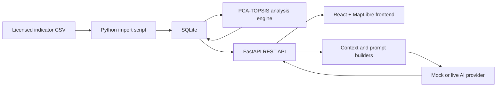

# UrbanInsight AI

[English](./README.md) | 简体中文

UrbanInsight AI 是一个以地图为核心的城市决策智能平台，用于探索和比较伦敦各行政区。平台将可复现的统计分析流程与 AI 解读层结合起来，帮助用户从区域指标出发，获得排名证据、分析解释、区域对比和可直接用于决策的报告。

本项目是一个在本地运行、处于作品集阶段的应用，尚未公开部署。仓库不包含第三方源数据集或 API 凭据。

## 项目时间线与个人职责

- **2024 年 11 月至 2025 年 1 月：** 三人合作完成的伦敦城市生活质量学术研究项目。我担任项目负责人。研究使用 PCA 进行综合评价，并通过 Moran's I、LISA 和 Getis-Ord Gi* 分析空间格局。
- **2026 年 6 月：** 我独立设计并实现了产品平台、后端数据管线、PCA 加权 TOPSIS 分析引擎、交互式前端，以及与具体供应商解耦的 AI 决策智能体。

PCA 加权 TOPSIS 属于 2026 年的平台开发阶段，并非最初小组研究的方法。

## 产品功能

1. 在交互式地图中搜索、悬停查看或选择伦敦行政区。
2. 通过 FastAPI 获取行政区指标和已保存的分析结果。
3. 展示综合得分、伦敦范围排名、维度得分、指标画像、PCA 贡献和 TOPSIS 结果。
4. 可选择为下一次分析启用 AI Insights，让所配置的 Provider 解读已有统计结果，而不重新计算这些结果。
5. 继续提出带上下文的问题或比较不同行政区，并导出适合决策使用的 PDF 报告或可编辑的 Markdown 报告。

## 核心特性

- 基于 MapLibre GL JS 的行政区探索，支持悬停、选择、搜索和镜头重置
- 英文和简体中文界面
- 按分析任务持久化 AI Insights 偏好，并提供基础分析回退
- 使用 SQLite 存储行政区、指标和分析结果
- 明确的 CSV 导入及数据库初始化脚本
- 基于 PCA 的客观赋权与 TOPSIS 排名
- 结构化 `AnalysisInsights` 生成
- 带上下文的追问与行政区比较
- 生成包含图表的 A4 PDF 报告，并支持 Markdown 作为次要导出格式
- OpenAI、Qwen 和 DeepSeek Provider 策略
- 面向 UI 开发、无需 Token 的 Mock AI 模式
- 响应式地图、AI 面板和分析工作区

## 技术架构



前端不会直接读取 SQLite 或指标 CSV。AI 层接收后端提供的结构化已存储结果，且不允许自行计算 PCA、TOPSIS 或排名。

## 技术栈

| 层级 | 技术 |
| --- | --- |
| 前端 | React、TypeScript、Vite、Tailwind CSS、shadcn/ui |
| 地图 | MapLibre GL JS |
| 图表 | Recharts |
| 国际化 | i18next、react-i18next |
| 后端 | Python、FastAPI、Pydantic |
| 数据库 | SQLite |
| 分析 | NumPy、pandas、scikit-learn |
| AI | OpenAI Python SDK，以及 OpenAI、Qwen、DeepSeek 和 Mock 策略 |
| 测试 | Python `unittest`、FastAPI TestClient、Mock Provider 调用 |

## 数据与分析

导入程序会校验以下精确的 15 列表头。每个行政区对应一行，其中包含 12 个效益型数值指标字段：

```text
Region,LAD code,Region name,GDHI per head of population (pounds),
Business Density per 1,000 Population (firms),
Average House Price/Earnings ratio_reverse,police_mean,
Convenient_service_mean,cultural_mean,meandical_mean,bus_new_mean,
ndvi_mean,wet_mean,landscape_index,Household Waste Recycling Rates (%)
```

2026 年的分析引擎先对指标进行标准化，再使用 PCA 推导客观指标权重，并将这些权重用于 TOPSIS，以计算贴近度得分和排名。源 CSV 已提供成本型指标的反向处理版本；分析引擎不会再次对这些字段进行反向转换。

最初的 2024—2025 年研究使用了 POI、土地利用、Landsat、官方统计和行政区边界等输入数据，空间分析包括 Global Moran's I、LISA 和 Getis-Ord Gi*。这些空间统计方法服务于原研究项目，当前 Web 平台不会重新计算它们。

### 数据许可与仓库政策

研究报告引用了 OpenStreetMap/Overpass Turbo、Impact Observatory/Esri Living Atlas 土地覆盖数据、USGS Landsat、London Datastore/ONS 统计数据，以及 UK Data Service 边界数据。这些上游来源具有不同的许可和署名要求。

本地汇编得到的 CSV 和 GeoJSON 文件缺少足够的字段级来源与许可元数据，因而无法证明这些汇编产物可以被再次分发。在完成独立的权利审查之前，这些文件会有意排除在公开仓库之外。即使项目软件未来采用某种许可，这些数据文件也不在该许可覆盖范围内。

如需运行项目，请自行准备具有适当许可的数据，并放置在以下路径：

```text
data/london_indicators.csv
data/london_boroughs.geojson
public/data/london_boroughs.geojson
```

两个 GeoJSON 路径目前应包含相同的 `FeatureCollection`：`data/` 中保存规范工作副本，`public/data/` 中保存供浏览器访问的副本。每个要素必须采用 `Polygon` 或 `MultiPolygon` 几何类型，并包含与 `Region name` 匹配的 `properties.name` 值。浏览器端 GeoJSON 缺失时，应用不会崩溃，但地图将无法显示行政区多边形。

准备数据前，请核对相关上游条款：

- [OpenStreetMap 版权与 ODbL 署名要求](https://www.openstreetmap.org/copyright/en)
- [Impact Observatory Maps for Good，CC BY 4.0](https://docs.impactobservatory.com/lulc-maps/maps-for-good.html)
- [USGS Landsat 公共领域说明](https://www.usgs.gov/faqs/are-landsat-data-cloud-still-considered-be-within-public-domain)
- [ONS 地理数据许可](https://www.ons.gov.uk/methodology/geography/licences)
- [UK Data Service 2011 Census geography boundaries](https://statistics.ukdataservice.ac.uk/dataset/2011-census-geography-boundaries-uk)

## AI 决策智能体

Provider 层通过统一的策略接口处理结构化洞察和纯文本响应。Web 界面的 AI 开关用于选择基础预设分析或当前请求级别的 Live 分析，相邻的选择器用于选择 DeepSeek 或 Qwen。当请求未指定 Provider 时，`AI_PROVIDER` 提供 Live 模式的默认值。`AI_MODE` 仍用于兼容旧调用、CLI 开发和自动化测试夹具，但不会覆盖 Web 端显式提出的 AI 请求。

对于结构化分析，系统要求 Provider 返回 JSON，随后进行防御性解析，并由 Pydantic 按 `AnalysisInsights` 模型完成验证。聊天、比较和报告接口则通过既有 API Schema 原样返回纯文本。

PDF 导出由独立、确定性的 ReportLab 管线完成。该管线将前端已有的完整分析元数据和结构化洞察，与后端重新加载的权威指标及已持久化的 PCA/TOPSIS 结果组合起来，不会再次调用 LLM。英文报告使用标准 PDF 字体栈；简体中文报告嵌入 Noto Sans CJK SC，该字体依据随附的 SIL Open Font License 分发。

主要的防幻觉措施包括：

- 统计结果从 SQLite 加载，而不是由模型生成；
- Prompt 明确区分证据与解读；
- 禁止模型重新计算得分或排名；
- 使用 Schema 验证结构化输出；
- 每次请求都在服务端重新构建行政区上下文；
- Provider 错误会经过清理后再返回前端。

这些措施可以降低风险，但不能保证内容完全准确。AI 建议仍属于解释性输出，在用于真实规划决策之前应经过人工审查。

## 项目结构

```text
backend/
  analysis/             PCA-TOPSIS analysis engine
  app/
    ai/                 agent, prompts, context, schemas, provider strategies
    database.py         SQLite connection and path resolution
    main.py             FastAPI application and routes
    repository.py       database queries
  scripts/              CSV import and analysis runners
  tests/                backend and provider tests
data/                   local source data (not distributed)
public/data/            browser-served GeoJSON (not distributed)
specs/                  product, UI, data, backend, AI, and configuration specs
src/
  app/                  application orchestration and state
  components/           map, search, AI panel, analysis workspace, UI primitives
  i18n/                 English and Simplified Chinese resources
  lib/                  API client and utilities
  styles/               design tokens and global styles
  types/                shared frontend types
```

## 本地运行

### 前置要求

- Node.js 20 或更高版本
- pnpm
- Python 3.11 或更高版本

### 前端

```bash
pnpm install
pnpm run dev
```

Vite 开发服务器通常运行在 `http://127.0.0.1:5173`。

### 后端

```bash
cd backend
python3 -m venv .venv
source .venv/bin/activate
pip install -r requirements.txt
cp .env.example .env
```

在项目根目录中初始化并导入数据库：

```bash
backend/.venv/bin/python -m backend.scripts.import_data \
  --csv data/london_indicators.csv
backend/.venv/bin/python -m backend.scripts.run_analysis
```

可以从以下任一位置启动 FastAPI：

```bash
# Project root
backend/.venv/bin/python -m uvicorn app.main:app --app-dir backend --reload

# Or backend/
.venv/bin/python -m uvicorn app.main:app --reload
```

两条命令都会将默认数据库解析为 `backend/urban_insight.db`。

## 环境配置

请以 `backend/.env.example` 为模板。不要通过 Vite 变量暴露密钥，也不要提交已填入实际值的 `.env`。

```dotenv
AI_MODE=mock
AI_PROVIDER=deepseek

OPENAI_API_KEY=
OPENAI_MODEL=gpt-4o-mini

DASHSCOPE_API_KEY=
QWEN_MODEL=
QWEN_BASE_URL=https://dashscope.aliyuncs.com/compatible-mode/v1

DEEPSEEK_API_KEY=
DEEPSEEK_MODEL=
DEEPSEEK_BASE_URL=https://api.deepseek.com

URBANINSIGHT_DB_PATH=
```

建议的工作流：

```text
UI development -> AI_MODE=mock -> no external LLM cost
AI integration testing -> AI_MODE=live -> configured provider
```

## 验证

```bash
# Frontend TypeScript compilation and production build
pnpm run build

# Backend compilation
backend/.venv/bin/python -m compileall backend

# Backend tests
PYTHONPATH=backend backend/.venv/bin/python -m unittest discover \
  -s backend/tests -v
```

自动化测试中的外部 LLM 调用均使用 Mock。

## API 概览

核心数据接口：

- `GET /boroughs`
- `GET /boroughs/{id}`
- `GET /indicators/{borough_id}`
- `GET /analysis/{borough_id}`

AI 接口：

- `GET /ai/status`
- `POST /ai/analyze`
- `POST /ai/chat`
- `POST /ai/compare`
- `POST /ai/report`
- `POST /reports/pdf`

后端运行时，可通过 `http://127.0.0.1:8000/docs` 查看交互式 API 文档。

## 当前限制

- 仓库不分发第三方源数据集，因此在本地运行前，需要另行准备具有适当许可的数据。
- 项目尚未公开部署，也未进行生产级加固。
- SQLite 与本地导入流程面向单用户演示场景。
- Live AI 的实际表现取决于 Provider 可用性、模型访问权限、配额和用户提供的凭据。
- AI 建议仅用于辅助决策，不能替代领域专家审查。
- 平台目前不会执行 Moran's I、LISA 或热点分析。
- 当前尚未选择项目软件许可。

## 截图

目前尚未包含公开截图。后续作品集更新可在 `docs/screenshots/` 下加入经过核验的应用截图。
