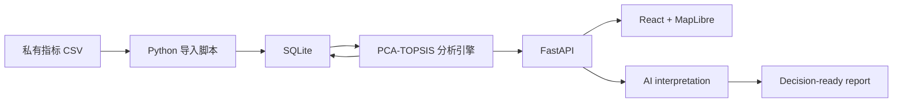

# UrbanInsight AI

[English](./README.md) | 简体中文

## AI 驱动的城市决策智能平台

UrbanInsight AI 是一个 AI 驱动的城市决策智能平台，将地理空间分析、PCA-TOPSIS 多指标评价、伦敦行政区交互探索与 AI 城市洞察整合为一套连续的决策支持体验。

> **作品集状态：** 源代码与可复现流程已公开，部署架构采用 Vercel 与 Railway；仓库目前未提供经过核验的公开 Demo 地址。处理后的指标 CSV 与服务端凭据保持私有。

## 项目概览

UrbanInsight AI 是一个以地图为核心、用于探索和比较伦敦行政区的城市决策智能平台。它将空间探索、可复现的统计证据、AI 解读、上下文比较和报告生成整合为一条连续的产品工作流。

用户可以：

- 通过交互式地图探索伦敦行政区；
- 查看指标、综合得分、排名和贡献证据；
- 请求 AI 解读已经存储的统计结果；
- 继续追问并比较不同的行政区；
- 导出面向决策的 PDF 报告或可编辑的 Markdown 报告。

它被设计为一个 **AI 城市分析助手**，而不是一个只停留在指标可视化层面的传统 Dashboard。

## 用户问题

传统区域分析通常分散在数据集、统计工具、地图、结果解读和报告撰写等多个环节。综合评分可以说明“结果是什么”，却不容易让非专业用户理解“为什么”。区域比较往往依赖人工处理，而信息密集的 Dashboard 有时反而会增加理解证据的难度。

> **我们如何把复杂的城市指标转化为易于理解、能够直接支持决策的探索体验？**

## 产品洞察

### 地图优先

地图提供空间语境，也是发现和选择行政区的主要入口。

### 统计是证据

确定性的 PCA 加权 TOPSIS 引擎生成可复现的得分、排名、维度结果和贡献证据。

### AI 负责解读

AI 对已存储的证据进行解释、总结和比较。它不会重新计算 PCA 或 TOPSIS，不会编造排名，也不会取代统计分析层。

### 报告承接决策输出

产品体验不止于 Dashboard 探索，而是将完整分析整理为可导出的 PDF 和 Markdown 报告。

## 产品体验

```text
探索地图
↓
选择行政区
↓
查看得分与证据
↓
启用 AI 解读
↓
继续追问
↓
比较行政区
↓
导出报告
```

## 核心功能

- 以地图为核心的伦敦行政区探索
- 行政区搜索、悬停预览、选择和镜头重置
- PCA 加权 TOPSIS 评分与排名
- 维度、指标和贡献度解读
- 默认关闭、对下一次分析生效的 AI 深度解读开关
- Qwen 与 DeepSeek Live AI 洞察，以及无需 Token 的 Mock 模式
- Provider 选择与后端 AI 运行模式状态反馈
- 指标定义与解读 Tooltip
- 带上下文的连续追问
- 行政区之间的对比分析
- 包含图表的 A4 PDF 与可编辑 Markdown 报告生成
- 英文与简体中文产品体验
- Live AI 关闭或不可用时的基础分析回退

## AI 产品设计

AI 层与数学分析引擎被有意分离。

| AI 负责 | AI 不负责 |
| --- | --- |
| 解读已提供的证据 | 重新计算 PCA |
| 总结优势与短板 | 重新计算 TOPSIS |
| 比较行政区上下文 | 编造得分或排名 |
| 生成解释性建议 | 取代原始证据或领域专家审查 |

结构化响应会经过 Schema 验证；Prompt 明确区分证据与解读；行政区上下文在服务端重新构建；Provider 错误在到达前端之前会被清理。

> **证据优先，解读在后。**

## 系统概览



前端与 AI 层都不会直接读取源 CSV。统计结果由独立引擎计算并持久化，再作为权威上下文提供给 AI。完整架构、本地运行、API、验证和数据政策请参阅[技术指南](./docs/TECHNICAL_GUIDE.md)。

## 产品截图

目前尚未加入经过核验、适合公开展示的产品截图。计划覆盖：

- 地图探索；
- 行政区分析；
- AI 洞察；
- 区域比较；
- 报告导出。

后续真实截图将存放在 [`docs/screenshots/`](./docs/screenshots/) 中。本仓库不会使用 Mock 或虚构的产品截图。

## 在线演示

**部署架构：** Vercel 前端 + Railway 后端。

仓库目前没有记录经过核验的公开 Demo 地址。本地或托管运行都需要单独注入私有指标数据，所有模型凭据仅保存在后端。

## 数据来源

- **地图边界：** MapLibre 使用的伦敦行政区 GeoJSON 来自 [`radoi90/housequest-data`](https://github.com/radoi90/housequest-data)。该上游仓库以 MIT 许可发布此文件；如再分发边界文件，应保留其版权与许可声明。
- **城市指标：** `data/london_indicators.csv` 是经过处理的私有分析数据，不包含在 GitHub 仓库中。部署时由后端安全注入，再导入 SQLite。

第三方数据不属于 UrbanInsight AI 未来可能采用的软件许可范围。CSV 字段结构与运行路径见[技术指南](./docs/TECHNICAL_GUIDE.md)。

## 部署方式

- **前端：** 部署至 Vercel，使用 `pnpm run build` 构建，并通过 `VITE_API_URL` 连接 Railway API。
- **后端：** 部署至 Railway；Root Directory 为 `backend`，Build Command 为 `pip install -r requirements.txt`，Start Command 为 `bash start.sh`。
- **后端运行配置：** `URBANINSIGHT_DATA_PATH`、`URBANINSIGHT_DB_PATH`、`PORT`、`AI_MODE` 与 `AI_PROVIDER`。Live AI 还需要对应 Provider 的密钥与模型配置。

私有数据注入、CORS、Mock/Live 模式与发布验证步骤见 [DEPLOYMENT.md](./DEPLOYMENT.md)。

## 角色与贡献

**独立产品设计与开发 — 2026 产品化阶段**

- 产品策略与作品集定位
- UX 与交互设计
- AI 工作流、Provider 策略和安全边界
- 数据分析架构与 PCA 加权 TOPSIS 实现
- 前后端实现
- 区域比较与报告工作流
- 英文与简体中文体验

本项目的分析基础来自 **2024 年 11 月至 2025 年 1 月的三人学术研究项目**，我在其中担任项目负责人。原研究使用 PCA 进行综合评价，并通过 Moran's I、LISA 和 Getis-Ord Gi* 开展空间分析。Web 平台、PCA 加权 TOPSIS 引擎、AI 决策智能体及产品实现由我在 2026 年 6 月独立设计和完成。TOPSIS 并非原小组研究的方法。

## 技术栈

`React` · `TypeScript` · `MapLibre GL JS` · `FastAPI` · `SQLite` · `PCA` · `TOPSIS` · `Qwen` · `DeepSeek` · `ReportLab`

## 文档

- [技术指南](./docs/TECHNICAL_GUIDE.md) — 架构、本地运行、数据准备、环境变量、API、测试和限制
- [公开项目档案](./docs/UrbanInsight_AI_Project_Archive.md) — 项目背景、关键决策、范围、个人贡献和演进过程
- [产品与工程规格](./specs/)
- [英文 README](./README.md)

## 免责声明

UrbanInsight AI 是一个独立的作品集阶段产品，尚未完成生产级加固。AI 输出属于解释性决策辅助，在用于真实规划决策前必须经过人工审查。Live 模式的实际表现取决于外部模型的可用性、访问权限、配额和后端凭据。

私有的处理后指标 CSV 不随仓库分发。伦敦行政区 GeoJSON 属于上文已署名的第三方材料，不属于项目未来软件许可的覆盖范围。当前尚未选择项目软件许可；随仓库提供的字体继续适用其自身的 SIL Open Font License。
